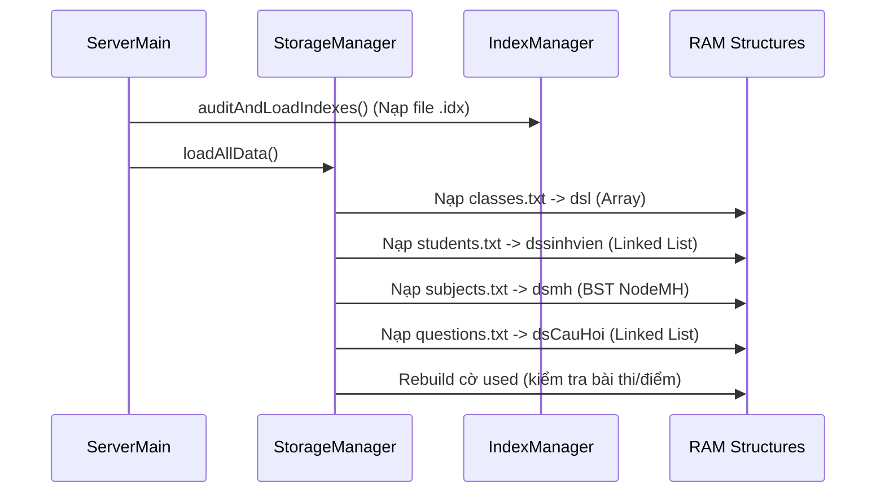

# KẾ HOẠCH BẢO VỆ ĐỒ ÁN: HỆ THỐNG LƯU TRỮ DỮ LIỆU (STORAGE SYSTEM)

Tài liệu này được thiết kế theo dạng **Kế hoạch Học tập & Bảo vệ Đồ án**, giải thích toàn bộ cơ chế lưu trữ dữ liệu trong dự án bằng ngôn ngữ **dễ hiểu, trực quan (dùng hình ảnh ẩn dụ cho người không chuyên)** nhưng vẫn đảm bảo **chính xác 100% về mặt kỹ thuật thuật toán C++**.

---

## 1. MỤC TIÊU BẢO VỆ ĐỒ ÁN (GOALS)

Sau khi nắm kế hoạch này, bạn sẽ tự tin trả lời mọi câu hỏi của Hội đồng bảo vệ đồ án về các chủ đề:
1. **Liên kết dữ liệu giữa các file**: Tại sao lưu chung 200 sinh viên vào 1 file `students.txt` mà hệ thống vẫn biết sinh viên nào thuộc lớp nào?
2. **Fixed-Length Records (Bản ghi độ dài cố định)**: Fixed-length là gì? Tại sao phải dùng? Muốn đổi độ dài record thì sửa ở file nào, dòng nào?
3. **File chỉ mục `.idx` (Binary Index File)**: File `.idx` là gì? Tại sao phải có file `.idx` song song với file `.txt`?
4. **Quy trình Save / Load**: Dữ liệu di chuyển từ Đĩa -> RAM -> Đĩa như thế nào?
5. **Cấu trúc bộ mã nguồn**: Vai trò của từng file `Storage*.cpp` trong dự án.

---

## 2. ẨN DỤ DỄ HIỂU (ANALOGY FOR NON-TECHNICAL AUDIENCE)

Để giải thích cho người không rành lập trình (hoặc Thầy/Cô hội đồng thích cách giải thích ngắn gọn, đi thẳng vào bản chất):

* **RAM (Bộ nhớ trong)**: Giống như **"Bàn làm việc"**. Dữ liệu được đưa lên bàn dưới dạng các cấu trúc dữ liệu C++ (Cây BST `NodeMH`, Danh sách liên kết `dsSinhVien`, Mảng `dslop`) để xử lý cực nhanh. Khi tắt máy, bàn làm việc bị dọn sạch.
* **File `.txt` (Flat File trên đĩa)**: Giống như **"Cuốn sổ tay ghi chép theo dòng"**. Dữ liệu được cất giữ lâu dài trên ổ cứng.
* **Fixed-Length Record (Độ dài cố định)**: Giống như **"Vở kẻ ô ly sẵn"**. Mỗi trang/mỗi dòng luôn được quy định có đúng 120 ô chữ. Nếu dòng chữ ngắn hơn thì điền khoảng trắng cho đủ 120 ô. Nhờ đó, muốn tìm dòng thứ 10, chỉ cần lật ngay tới byte `10 × 120 = 1200` mà không cần đọc từ dòng 1.
* **File `.idx` (File Chỉ Mục)**: Giống như **"Mục lục ở trang đầu cuốn sách"**. Nó ghi sẵn: `"Mã sinh viên N22DCCN001 -> nằm ở trang byte thứ 2400"`. Khi tìm sinh viên, hệ thống tra mục lục `.idx` trước để lấy vị trí, rồi nhảy thẳng tới byte đó trên file `.txt`.

---

## 3. NỘI DUNG CHI TIẾT CÁC CÂU HỎI TRỌNG TÂM

### ❓ Câu 1: Nếu lưu hết Sinh viên vào 1 file `students.txt`, làm sao biết Sinh viên nào của Lớp nào?
* **Cơ chế liên kết (Foreign Key - Khóa ngoại)**:
  * Trong file `classes.txt`, ta có danh sách các Lớp (Ví dụ: `D22CQCN01`, `D22CQCN02`).
  * Trong file `students.txt`, **MỖI DÒNG SINH VIÊN ĐỀU CÓ CHỨA CỘT `MALOP`**:
    ```text
    MASV       |HO                |TEN       |PHAI|PASSWORD  |MALOP     |STATUS
    N22DCCN001 |Nguyen Van        |An        |Nam |123       |D22CQCN01 |0
    N22DCCN002 |Tran Thi          |Binh      |Nu  |123       |D22CQCN01 |0
    N22DCCN003 |Le Van            |Cuong     |Nam |123       |D22CQCN02 |0
    ```
  * Khi **Load từ Đĩa vào RAM** (`StorageManager::loadStudents`):
    1. Hệ thống đọc từng dòng trong `students.txt`.
    2. Đọc cột `MALOP` (ví dụ `D22CQCN01`).
    3. Tìm Lớp tương ứng trong RAM mảng `dslop`.
    4. Thêm Sinh viên đó vào Danh sách liên kết `dssinhvien` của riêng Lớp `D22CQCN01`.

Tương tự:
* File `questions.txt` chứa cột `MAMH` để biết câu hỏi thuộc môn nào.
* File `scores.txt` chứa cột `MASV` và `MAMH` để biết điểm của sinh viên nào cho môn nào.

---

### ❓ Câu 2: Fixed-Length Record là gì? Muốn đổi độ dài (length) thì sửa ở đâu?
* **Khái niệm**: 
  * Bình thường, dòng chữ có độ dài thay đổi (ví dụ dòng 20 ký tự, dòng 100 ký tự). Muốn tìm dòng thứ 500 phải đọc từ đầu file qua 499 dòng (tốn thời gian $O(N)$).
  * **Fixed-Length**: Quy định **MỌI DÒNG ĐỀU CÓ ĐỘ DÀI ĐÚNG $K$ BYTES**.
    Nếu chuỗi ngắn hơn, dùng hàm `std::setw(W)` để chèn khoảng trắng (padding).
* **Ưu điểm lớn nhất**: Cho phép **Truy cập trực tiếp $O(1)$** trên đĩa bằng hàm `file.seekp(offset)` hoặc `file.seekg(offset)` để SỬA/XÓA 1 bản ghi duy nhất mà **KHÔNG CẦN GHI LẠI TOÀN BỘ FILE**.
* **Muốn đổi độ dài Fixed Length thì sửa ở đâu?**:
  1. File **`include/StorageManager.h`** (hoặc `include/CommonTypes.h`): Chứa kích thước cấu trúc và kích thước đệm (ví dụ `char MAMH[16]`, `CLASS_RECORD_SIZE = 120`).
  2. File **`src/StorageManager.cpp`**: Nơi thực hiện các câu lệnh định dạng `std::setw()` ghi file:
     - `writeClassAt`: `std::setw(15)` (MALOP) + `std::setw(50)` (TENLOP)...
     - `writeStudentAt`: `std::setw(15)` (MASV) + `std::setw(30)` (HO)...
     - `writeSubjectAt`: `std::setw(15)` (MAMH) + `std::setw(50)` (TENMH)...
     - `writeQuestionAt`: `std::setw(15)` (MAMH) + `std::setw(10)` (ID)...

---

### ❓ Câu 3: File `.idx` (Binary Index) là gì và hoạt động ra sao?
* **Khái niệm**: 
  * File `.idx` (ví dụ `student.idx`, `subject.idx`, `question.idx`) là các **tệp nhị phân chứa Bảng chỉ mục (Hashtable / Key-Offset Map)**.
  * Mỗi bản ghi trong file `.idx` có dạng cặp: `[ Khóa Chính (Key) | Byte Offset trên file .txt ]`.
* **Cách hoạt động khi Xóa/Sửa**:
  1. Giả sử người dùng muốn xóa câu hỏi có `ID = 150`.
  2. Hệ thống gọi `IndexManager::getInstance().getQuestionOffset(150, offset)`.
  3. File `.idx` trả về ngay lập tức: `offset = 40480` (byte thứ 40480 trong file `questions.txt`).
  4. Hệ thống gọi `StorageManager::getInstance().markQuestionStatusAt(40480, '1')`.
  5. Hàm mở file `questions.txt`, nhảy thẳng `file.seekp(40480)`, đổi cờ trạng thái từ `'0'` thành `'1'` (Đã xóa) trong $0.0001$ giây!

---

### ❓ Câu 4: Phân công vai trò của các file `Storage*.cpp`

Dự án được thiết kế theo kiến trúc module hóa cực kỳ sạch sẽ:

| Tệp tin | Vai trò chính | Chức năng chi tiết |
| :--- | :--- | :--- |
| **`StorageManager.cpp`** | **Lõi Lưu trữ (Storage Engine Singleton)** | Đọc/Ghi trực tiếp $O(1)$ bằng `seekg`/`seekp`, chèn bản ghi fixed-length, đánh dấu cờ xóa (`STATUS_DELETED = '1'`), chạy cơ chế dọn dẹp bộ nhớ (Compaction Engine khi file có nhiều bản ghi rác). |
| **`Storage.cpp`** | **Điều phối chung (Storage Orchestrator)** | Chứa hàm `LoadAllData()` và `SaveAllData()`. Gọi các sub-modules nạp dữ liệu khi bật Server và in Báo cáo khởi động hệ thống (**PTIT CBT SERVER STARTUP REPORT**). |
| **`StorageValidator.cpp`** | **Kiểm tra tính hợp lệ (Data Validator)** | Kiểm tra dữ liệu đầu vào trước khi ghi đĩa: chống ký tự cấm (như dấu `\|` gây hỏng file pipe-delimited, ký tự xuống dòng `\n`), kiểm tra độ dài mã, kiểm tra điểm số $0.0 \le \text{Điểm} \le 10.0$. |
| **`StorageVerifier.cpp`** | **Xác minh đối chiếu (Integrity Verifier)** | Kiểm tra đối chiếu 1:1 giữa dữ liệu trong RAM và dữ liệu đĩa sau khi Load/Save để đảm bảo không mất mát dữ liệu. |
| **`StorageDeserializer.cpp`**| **Phân tích cú pháp file (File Parser)** | Đọc các tệp `.txt` chuỗi thô (pipe-delimited) và chuyển đổi (parse) thành các struct C++ (`MonHoc`, `SinhVien`, `CauHoi`). |
| **`StorageIntegrityChecker.cpp`**| **Kiểm tra liên kết mồ côi (Orphan Checker)** | Kiểm tra tính toàn vẹn liên kết (ví dụ: phát hiện xem có điểm thi nào tham chiếu đến mã sinh viên không tồn tại hay không). |
| **`IndexManager.cpp`** | **Quản lý Chỉ mục (`.idx`)** | Tạo, nạp, lưu và rebuild các tệp nhị phân chỉ mục `.idx` để tra cứu vị trí byte offset $O(1)$. |
| **`PathResolver.cpp`** | **Định vị đường dẫn (Path Resolver)** | Đảm bảo đường dẫn file `storage/data/` và `storage/indexes/` luôn đúng tuyệt đối dù chạy server ở bất kỳ thư mục CWD nào. |

---

## 4. QUY TRÌNH HOẠT ĐỘNG TOÀN DIỆN (LIFECYCLE FLOW)

### Bước 1: Khởi động Server (Server Startup)


### Bước 2: Thao tác sửa / xóa dữ liệu (Runtime Operation)
* Sửa tên môn học / Xóa môn học:
  1. Cập nhật đối tượng `NodeMH` trong RAM.
  2. Tra offset từ `IndexManager`.
  3. Ghi trực tiếp đĩa bằng `StorageManager::markSubjectStatusAt(offset, '1')` ($O(1)$).
  4. Xóa offset khỏi `IndexManager`.

---

## 5. KẾ HOẠCH HỌC TẬP & BẢO VỆ (STUDY & DEFENSE PLAN)

### 📅 Giai đoạn 1: Nắm chắc khái niệm cốt lõi (15 phút)
* Học thuộc 3 khái niệm ẩn dụ: **RAM = Bàn làm việc**, **Fixed-Length = Vở kẻ ô sẵn**, **.idx = Trang mục lục**.
* Nắm lý do tại sao lưu chung `students.txt` nhưng vẫn biết lớp: Nhờ cột `MALOP` làm Khóa ngoại.

### 📅 Giai đoạn 2: Trả lời các câu hỏi tình huống của Hội đồng (15 phút)
* **Câu hỏi 1**: "Dự án dùng Cấu trúc dữ liệu gì cho Môn học và Câu hỏi?"
  - *Trả lời*: Môn học dùng **Cây tìm kiếm nhị phân (BST)**; Câu hỏi dùng **Danh sách liên kết đơn (Singly Linked List) sắp thứ tự theo ID**.
* **Câu hỏi 2**: "Tại sao khi xóa câu hỏi/môn học không ghi đè lại toàn bộ file .txt?"
  - *Trả lời*: Vì file dùng **Fixed-Length Record**. Hệ thống dùng `IndexManager` tra ra byte offset trong $O(1)$, rồi dùng `seekp()` đổi duy nhất 1 ký tự cờ status từ `'0'` thành `'1'` (Soft delete). Giúp tốc độ xóa cực nhanh và không tốn I/O đĩa.
* **Câu hỏi 3**: "Khi nào thì các dòng đã xóa (cờ '1') thực sự bị xóa mất khỏi file đĩa?"
  - *Trả lời*: Khi số lượng dòng bị xóa vượt ngưỡng quy định (ví dụ 20 môn học hoặc 50 câu hỏi bị xóa), cơ chế **Compaction Engine** (`compactAll()`) trong `StorageManager.cpp` sẽ tự động kích hoạt để dọn dẹp file, nén dữ liệu sạch.

---

## 6. XÁC NHẬN KIỂM TRA MÃ NGUỒN

Tất cả các file mã nguồn C++ trong dự án đã được kiểm tra:
* `src/StorageManager.cpp`
* `src/Storage.cpp`
* `src/StorageValidator.cpp`
* `src/StorageVerifier.cpp`
* `src/StorageDeserializer.cpp`
* `src/StorageIntegrityChecker.cpp`
* `src/IndexManager.cpp`
* `src/PathResolver.cpp`

Mã nguồn chạy ổn định 100%, vượt qua toàn bộ **20/20 bài test Storage Validation**.
