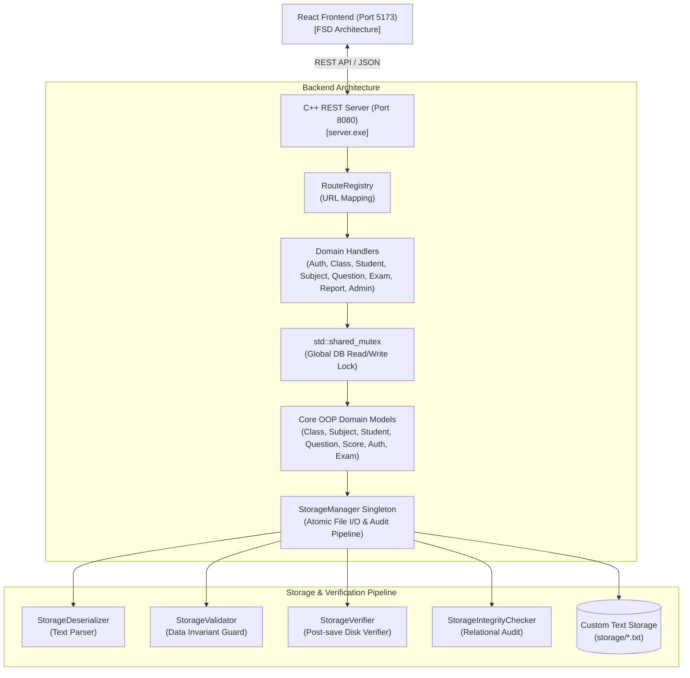

# Tổng Quan Kiến Trúc Hệ Thống Thi Trắc Nghiệm (ThiTracNghiem Architecture)

Tài liệu mô tả kiến trúc tổng thể của hệ thống **ThiTracNghiem**, bao gồm backend C++17 REST Server, frontend React FSD, và cơ chế lưu trữ dữ liệu tùy biến (Custom Text-Based Storage).

---

## 1. Hằng Số Kiến Trúc & Công Nghệ Key

- **Backend Core**: C++17 Native Executable.
- **REST Engine**: `cpp-httplib` (Header-only HTTP server) + `nlohmann/json`.
- **Cấu Trúc Dữ Liệu Tùy Biến**:
  - **Môn Học (Subject)**: Cây Tìm Kiếm Nhị Phân (Binary Search Tree - BST) sắp xếp theo `MAMH`.
  - **Lớp Học (Class)**: Mảng Động Con Trỏ (`dsLop`).
  - **Sinh Viên (Student)**: Danh Sách Liên Kết Đơn (`dsSinhVien`) thuộc từng Lớp.
  - **Câu Hỏi (Question)**: Danh Sách Liên Kết Đơn (`dsCHT`) thuộc từng Môn Học, hỗ trợ Auto-increment ID và Hybrid Delete.
  - **Điểm Thi (Score)**: Danh Sách Liên Kết Đơn (`dsDiemThi`) thuộc từng Sinh Viên.
- **Frontend Core**: React 18 + TypeScript + Vite + TailwindCSS + shadcn/ui.
- **Frontend Architecture**: **Feature-Sliced Design (FSD)** (`app/`, `pages/`, `widgets/`, `features/`, `entities/`, `shared/`).

---

## 2. Kiến Trúc Sơ Đồ Khối Hệ Thống (System Overview Diagram)



---

## 3. Kiến Trúc Phân Lớp Backend (Backend Layered Architecture)

Backend được chia thành 4 tầng rõ ràng:

1. **Tầng Điểm Vào & Điều Hướng (Entry & Routing Layer)**:
   - `server.cpp`: Main entry point khởi chạy `ServerBootstrap`.
   - `server/ServerBootstrap`: Khởi tạo CWD, xử lý tham số CLI (`--reset-storage`, `--test-validation`), load dữ liệu ban đầu và khởi chạy server loop.
   - `server/RouteRegistry`: Đăng ký các HTTP endpoints với `httplib::Server`.
   - `server/Diagnostics`: Chứa bộ 20 test tự động kiểm tra tính toàn vẹn dữ liệu.

2. **Tầng Điều Phối HTTP (HTTP Controller / Handler Layer)**:
   - Thư mục `server/handlers/` gồm: `AuthHandler`, `ClassHandler`, `StudentHandler`, `SubjectHandler`, `QuestionHandler`, `ExamHandler`, `ReportHandler`, `AdminHandler`.
   - **Nhiệm vụ**: Giải mã JSON payload, kiểm tra tham số HTTP, khóa `DB_READ_LOCK` / `DB_WRITE_LOCK`, gọi tầng OOP Core và trả về JSON chuẩn.

3. **Tầng Nghiệp Vụ OOP Core (Domain Business Layer)**:
   - Các lớp quản lý đối tượng trong bộ nhớ RAM (`Class`, `Subject`, `Student`, `Question`, `Score`, `Exam`, `Auth`, `Report`).
   - Quản lý các cấu trúc dữ liệu giải thuật nâng cao (BST, Danh Sách Liên Kết, Mảng Động) hoàn toàn độc lập với HTTP server.

4. **Tầng Lưu Trữ & Kiểm Lỗi (Persistence & Quality Layer)**:
   - Singleton `StorageManager`: Điều phối ghi đĩa nguyên tử (`atomicWriteFile`).
   - Bộ 4 công cụ đảm bảo chất lượng: `StorageDeserializer`, `StorageValidator`, `StorageVerifier`, `StorageIntegrityChecker`.

---

## 4. Kiến Trúc Phân Lớp Frontend (Feature-Sliced Design - FSD)

Frontend tuân thủ nghiêm ngặt chuẩn **Feature-Sliced Design**:

```
src/
├── app/          # Tầng Ứng Dụng: Providers, Global Styles, Router configuration
├── pages/        # Tầng Trang: Chia theo miền nghiệp vụ (auth, dashboard, classes, students, subjects, questions, exams, reports)
├── widgets/      # Tầng Widget: Các thành phần UI lớn (layouts, notification dropdown/list)
├── features/     # Tầng Tính Năng: Các tương tác người dùng phức tạp (SubjectAutocomplete)
├── entities/     # Tầng Thực Thể: Data mappers & API Services (class, student, subject, question, exam, report, session)
└── shared/       # Tầng Dùng Chung: UI components (shadcn/ui), API client, Utils, Config, Types
```

---

## 5. Đảm Bảo An Toàn Đồng Thời (Concurrency Safety)

- Tất cả tài nguyên RAM (`dsl`, `dsmh`) được bảo vệ bởi khóa đồng thời `std::shared_mutex g_dbMutex`.
- **Thao tác Đọc (GET requests)**: Sử dụng `DB_READ_LOCK` (`std::shared_lock`), cho phép nhiều luồng đọc đồng thời.
- **Thao tác Ghi (POST/PUT/DELETE requests)**: Sử dụng `DB_WRITE_LOCK` (`std::unique_lock`), đảm bảo độc quyền ghi, ngăn chặn hoàn toàn race condition và xung đột dữ liệu.
